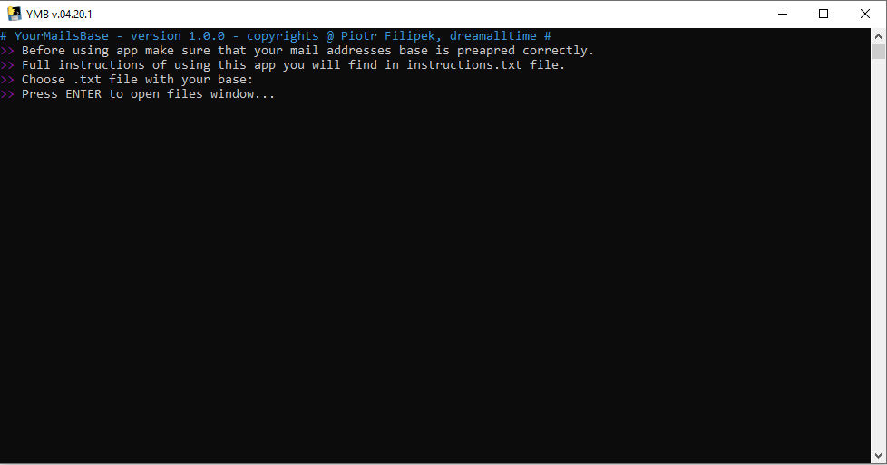
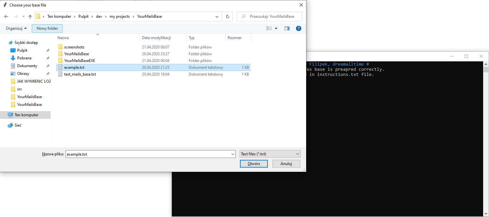
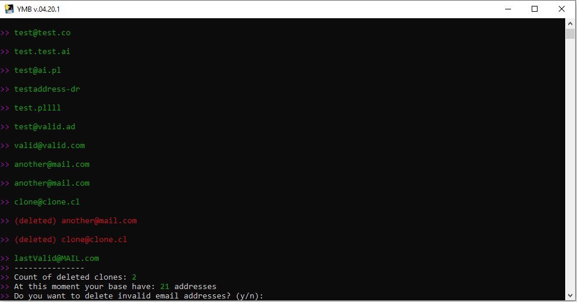
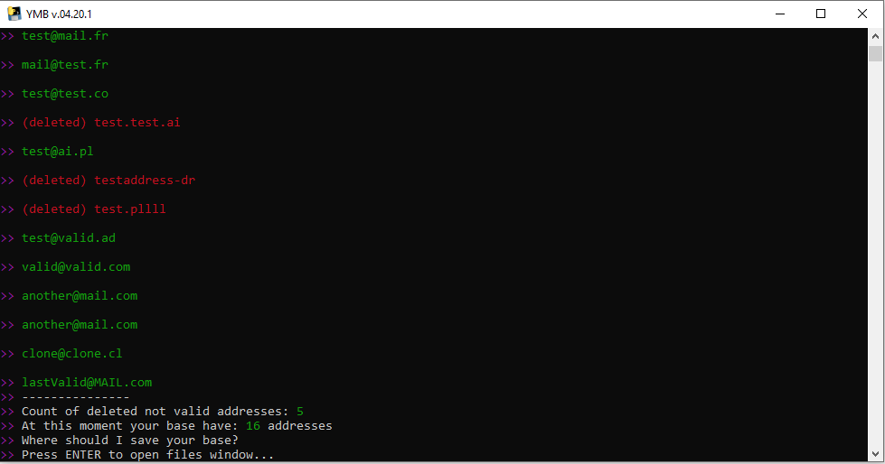
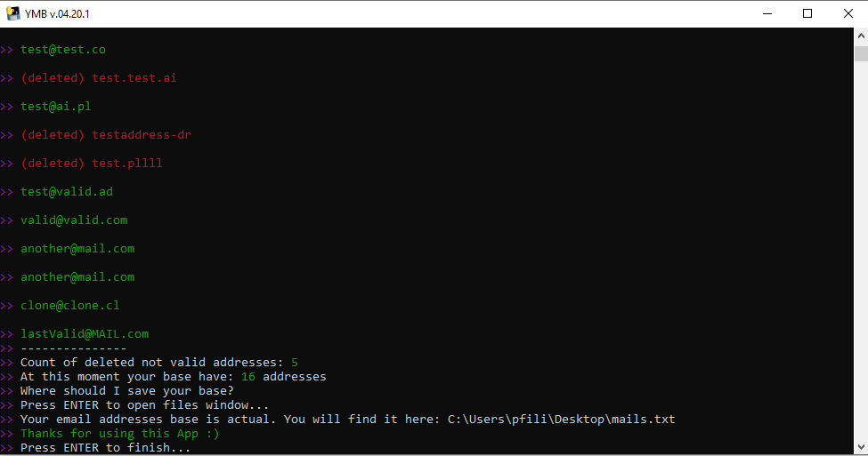

# YMB (YourMailsBase)

YMB is easy way to valid your mails addresses base, by checking correctness of every address and deleting duplicated items. 
YMB automates processing huge amounts of addresses and updates even big bases in just a seconds. 

## Getting Started 
### Requirements
The only thing that you need to run YMB is a computer with Windows OS (Linux and MacOS will be supported soon).
### Installing
To get YMB on your computer just download this .zip file from [here](#). 
Extract files in your prefered place and voilà!
### Before using! 
Before running YMB first time, make sure that you have corretly prepared addresses base. For more instructions open *'instructions.txt'*. 
There you will find full instruction of using YMB. 

## Built with
* [easygui](https://pypi.org/project/easygui/) - Module used for opening and saving files windows. 
* [termcolor](https://pypi.org/project/termcolor/) - Module used to set colors in console.
* [colorama](https://pypi.org/project/colorama/) - Module used to make working termcolor on Windows. 
* [validate_email](https://pypi.org/project/validate_email/) - Module used to validate emails corretness.  
* [pyinstaller](https://pypi.org/project/PyInstaller/) - Module used to make *.exe* file. 

## Versioning
### Current version
* [YMB v.04.20.1](#) - first version of YMB, just released. 
### Earlier versions
* [YMB v.04.20.1](#) - first version of YMB, just released. 

## How it looks?

## Author
* **Piotr "dreaMu" Filipek** 
